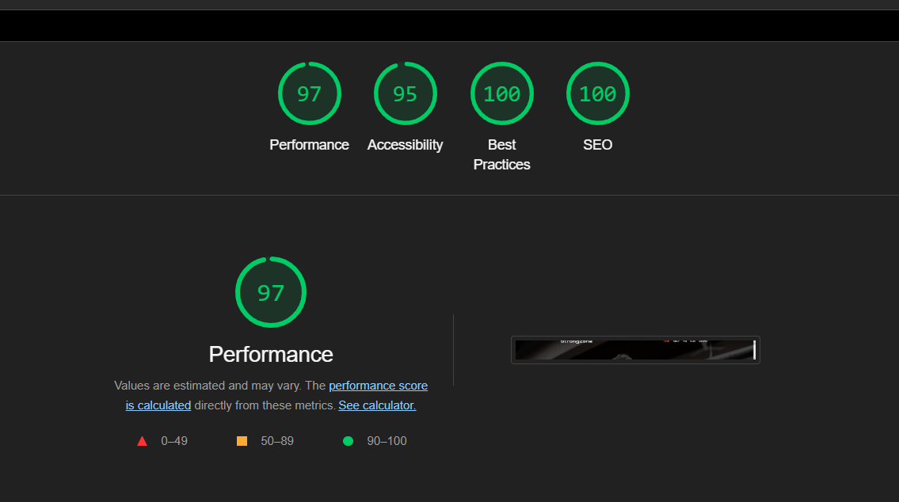

# www.krystianptak.pl/StrongZone
## Project Description:
This React-based website is a dynamic and fully responsive platform designed for a fitness-oriented business. Leveraging the power of React and various libraries, the project incorporates modern web development practices to deliver an engaging user experience. Below are the key features and technologies used in this project:

## **Impressive Performance and Optimal Practices**
I would like to start by highlighting the outstanding success of this project. After conducting thorough tests using the Lighthouse Console tool and performing an in-depth website analysis, the results were truly impressive. All key performance indicators related to performance, accessibility, and best SEO practices are looking remarkable, nearing perfection at nearly 100%. I've attached an image showcasing these exceptional results for your reference.

## **Responsive Design**
The design of the project is made responsive, meaning that the webpage adapts to different screen sizes, ensuring optimal display on computers, tablets, and smartphones.

## **React and React Router**
The project is built using React, a powerful JavaScript library for building user interfaces.
React Router is employed for seamless navigation between different sections of the website, providing a smooth and single-page application experience.

## **Formik for Form Validation**
Formik is implemented for form validation, providing a robust and efficient way to validate forms throughout the website. This ensures data integrity and a smooth user input experience.

## **Add to Cart**
Each product has an "Add to Cart" button, allowing users to add items to their cart. After adding, users receive confirmation, and the quantity and total price of items in the cart are updated.

## **Persistent Cart**
Items added to the cart remain even after refreshing the page or leaving the site, enhancing shopping convenience and comfort.

## **Framer Motion Animations**
Framer Motion library is utilized to add engaging animations throughout the site, enhancing user engagement and providing a visually appealing experience.

## **Slick Carousel**
The Slick Carousel library is integrated to create a dynamic component showcasing testimonials and logos of associated companies, adding a professional touch to the website.

## **React CountUp**
The React CountUp library is used to implement a counter feature, providing animated number transitions to highlight key statistics or achievements on the site.

## **Modal and Accordion Components**
Custom modal and accordion components are implemented to enhance user interaction and provide a clean, intuitive interface.

## **Active Links and NotFound Page**
Active links ensure that users can easily identify their current location within the website.
A custom 404 Not Found page is included to handle any navigation errors gracefully.

## **Hero Component**
A reusable Hero component with dynamic graphics is created, maintaining a consistent visual identity across various pages.

## **Blog Section with ID-based Routing**
Each article in the blog section is assigned a unique identifier (ID), enabling dynamic routing and creating dedicated pages for a complete reading experience.

## **ScrollToTop Functionality**
The ScrollToTop functionality ensures that users are scrolled to the top of the page when navigating between different sections.

## **Footer**
A well-designed footer is included, providing essential links and information for easy navigation and contact.

## **Contact**
In the contact section, users have the ability to send inquiries via email directly from the website. To initiate this process, users need to provide their name, email address and subject. Without these details, an error prompt ensures that all necessary information is provided before sending the email.

## **Email, Phone, and Map Interaction**
Clicking on the email address, phone number or map opens the respective application. Additionally, the contact section includes an interactive map that provides a visual representation of the gym's location, enhancing the overall user experience.

